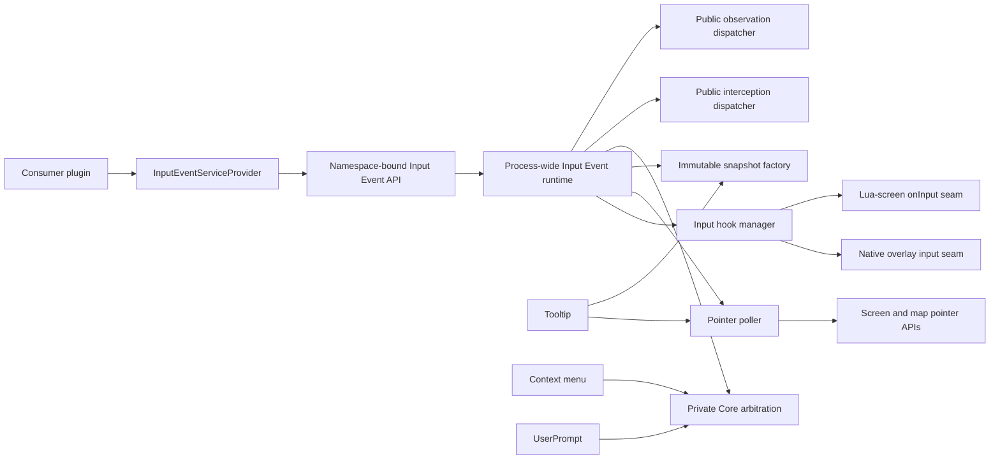

# DwarfUICore Input Event Service Proposal

## Status

Proposed on 2026-08-05 and revised after contract review. This document defines
the intended version 1 public
contract and private runtime responsibilities for review. It does not authorize
implementation until the contract is approved.

The proposed service extracts existing DwarfUICore input interception and
pointer sampling into one process-wide owner. It does not replace the tooltip,
context-menu, or UserPrompt services, and it does not move their behavioral
policy into a generic event bus.

## Summary

DwarfUICore should provide an `InputEventServiceProvider` that exposes
namespace-bound map-click and raw-click interception and observation while
supporting shared private input infrastructure for Core services.

The process-wide Input Event runtime should own:

- native-overlay and Lua-screen input interception;
- continuous pointer and optional map-position sampling;
- immutable, sequenced input snapshots;
- deterministic pre-delegation arbitration for Core input consumers;
- non-consuming public event observation;
- demand-driven activation and teardown; and
- error containment, diagnostics, and reload adoption.

Tooltip, context menu, UserPrompt, and future systems should consume this shared
runtime while retaining their own target detection, state transitions,
presentation, and service-specific registrations.

Contract major 1 should publicly expose unobstructed map-click and
coordinate-qualified raw-click channels. Each channel supports explicit
pre-delegation interception and post-delegation observation.

## Motivation

DwarfUICore already has reusable input mechanisms, but their ownership is split
across consumer-specific modules:

- `dwarfuicore/context_menu/input_hook.lua` owns the authoritative native and
  Lua-screen pre-delegation input wrappers;
- `dwarfuicore/context_menu/input_sample.lua` samples screen and map coordinates
  for intercepted input;
- `dwarfuicore/pointer_poller.lua` provides demand-driven screen and map pointer
  samples;
- `dwarfuicore/tooltip/registration.lua` owns tooltip polling orchestration;
- context menu performs its own input classification and sampling; and
- UserPrompt composes through the context-menu-owned input seam despite not
  being a context-menu feature.

This structure works, but generic infrastructure is named and initialized as
though it belongs to individual consumers. Adding a public map-click event
directly to ContextMenu would deepen that ownership mismatch and encourage
future services to depend on context-menu internals.

The code already demonstrates the correct lower-level concepts: one process
hook chain, immutable samples, demand-aware map sampling, generation-aware
reload behavior, and consumer-specific target mediation. The new service should
make those boundaries explicit without centralizing unrelated UI policy.

## Goals

- Expose a typed `InputEventServiceProvider` through
  `reqscript('dwarfuicore/services')`.
- Support one `observe(event_type, callback)` operation for non-consuming
  post-delegation notification.
- Support one `intercept(event_type, handler)` operation for pre-delegation
  input arbitration.
- Define `MAP_CLICK` and `RAW_CLICK` through a public immutable numeric
  `InputEventType` enum.
- Make the commonly used map-click event mean that a mouse input occurred over
  an exact map tile and no UI element obstructed that tile.
- Deliver raw-click events for every mouse input where DFHack reports a map
  position, even when UI obstruction prevents the map-click event.
- Keep observation non-consuming and allow only explicit interceptors to claim
  input.
- Preserve base-game input behavior when observers are present.
- Own exactly one process-wide native/Lua input interception chain.
- Own exactly one process-wide pointer poller.
- Sample screen and map coordinates at most once for each dispatched snapshot.
- Store sampled coordinates only as immutable `ScreenPosition` and
  `MapTilePosition` values, never as separate per-axis snapshot or event
  fields.
- Allow tooltip, context menu, and UserPrompt to share input mechanics while
  retaining their existing semantics.
- Provide deterministic private Core-consumer arbitration before inherited
  input handling.
- Activate hooks and polling only while a public subscription or private Core
  consumer has demand.
- Follow existing namespace, identity, immutability, generation, error, reload,
  and package conventions.

## Non-goals

- A general application event bus.
- String-dispatched event names or a public generic `subscribe(event_name)` API.
- Public keyboard events or synthesized hover, drag, or double-click gestures.
- Consumer-defined numeric priorities or reordering of private Core consumers.
- A global replacement for DFHack `onInput` methods.
- Shared tooltip/context-menu target registries or contribution selection.
- Shared presentation, rendering, menu opening, or prompt state machines.
- Inferring unobstructed ownership through uninspectable third-party surfaces;
  an unknown surface conservatively obstructs semantic map clicks.
- Replacing `PointerDispatcher`, tooltip target adapters, context-menu target
  adapters, or map projection policy.
- Migrating external DwarfUI consumers as part of the initial implementation.

## Terminology

An **input snapshot** is an immutable, sequenced copy of facts sampled while one
DFHack input table is being dispatched. Its optional screen and map coordinates
are immutable position values, not separate axis fields.

A **pointer sample** is an immutable, sequenced screen-pointer snapshot produced
by the shared poller. It may include a map position when current demand requires
one. Both positions use the same immutable value types as intercepted input.

A **Core input consumer** is a private DwarfUICore collaborator that may claim
an intercepted input boundary before the inherited handler runs.

A **public observer** is a namespace-bound callback registered for one exact
event type that receives a derived event after inherited input handling and
cannot consume or alter dispatch.

A **public interceptor** is a namespace-bound handler registered for one exact
event type that receives a derived event before inherited input handling and
explicitly returns `PASS` or `CONSUME`.

A **map click** is an eligible DFHack input table containing one or more mouse
inputs whose synchronous map sample is non-nil and whose screen position is
unobstructed by every known eligible UI root. It means mouse input occurred over
an exact map tile and no UI element was in the way.

A **raw click** is an eligible DFHack input table containing one or more mouse
inputs whose synchronous map sample is non-nil. The event reports that coordinate
as context but does not call the interaction a map click: the mouse input may
have landed on a UI element.

A **mouse input** is one key in a DFHack input table that the host classifies as
mouse input. The classification is open to host-supported buttons, press and
release boundaries, wheel inputs, and future mouse keys; it is not limited to
left or right buttons.

## Public API

### Provider acquisition

The service follows the existing exact-version, namespace-bound provider
pattern:

```lua
local services = reqscript('dwarfuicore/services')

local inputEvents =
    services.InputEventServiceProvider:new(1, 'my-plugin')
```

Every `new()` call returns a distinct immutable API object. API objects bound to
the same namespace share one namespace domain, and all namespaces delegate to
one process-wide Input Event runtime.

### Click interception and observation

```lua
local observation = inputEvents:observe(
        inputEvents.EventType.MAP_CLICK, function(event)
    local position = event.map_position
    -- position is an immutable copied {x, y, z} value
end)

local interception = inputEvents:intercept(
        inputEvents.EventType.MAP_CLICK, function(event)
    -- perform the map interaction before inherited input handling
    local mouseInputs = event.mouse_inputs
    return inputEvents.Disposition.CONSUME
end)

local rawObservation = inputEvents:observe(
        inputEvents.EventType.RAW_CLICK, function(event)
    local position = event.map_position
    -- the click may have landed on a UI element
end)
```

The proposed version 1 types are:

```lua
---@class dwarfuicore.MapClickedEvent
---@field type dwarfuicore.InputEventType
---@field sequence integer
---@field mouse_inputs dwarfuicore.MouseInput[]
---@field map_position dwarfuicore.MapTilePosition
---@field screen_position dwarfuicore.ScreenPosition

---@class dwarfuicore.RawClickEvent
---@field type dwarfuicore.InputEventType
---@field sequence integer
---@field mouse_inputs dwarfuicore.MouseInput[]
---@field map_position dwarfuicore.MapTilePosition
---@field screen_position dwarfuicore.ScreenPosition|nil

---@class dwarfuicore.MouseInput
---@field key string

---@alias dwarfuicore.InputEvent dwarfuicore.MapClickedEvent|dwarfuicore.RawClickEvent
---@alias dwarfuicore.InputEventObserver fun(event: dwarfuicore.InputEvent)
---@alias dwarfuicore.InputEventInterceptor fun(event: dwarfuicore.InputEvent): dwarfuicore.InputEventDisposition

---@enum dwarfuicore.InputEventType
local InputEventType = {
    MAP_CLICK = 1,
    RAW_CLICK = 2,
}

---@enum dwarfuicore.InputEventDisposition
local InputEventDisposition = {
    PASS = 1,
    CONSUME = 2,
}

---@class dwarfuicore.InputEventTypeEnum
---@field MAP_CLICK dwarfuicore.InputEventType
---@field RAW_CLICK dwarfuicore.InputEventType

---@class dwarfuicore.InputEventDispositionEnum
---@field PASS dwarfuicore.InputEventDisposition
---@field CONSUME dwarfuicore.InputEventDisposition

---@class dwarfuicore.InputEventSubscription

---@class dwarfuicore.InputEventServiceApi
---@field EventType dwarfuicore.InputEventTypeEnum
---@field Disposition dwarfuicore.InputEventDispositionEnum
---@field get_contract_version fun(self: dwarfuicore.InputEventServiceApi): integer
---@field get_namespace fun(self: dwarfuicore.InputEventServiceApi): string
---@field observe fun(self: dwarfuicore.InputEventServiceApi, event_type: dwarfuicore.InputEventType, callback: dwarfuicore.InputEventObserver): dwarfuicore.InputEventSubscription
---@field intercept fun(self: dwarfuicore.InputEventServiceApi, event_type: dwarfuicore.InputEventType, handler: dwarfuicore.InputEventInterceptor): dwarfuicore.InputEventSubscription
---@field unsubscribe fun(self: dwarfuicore.InputEventServiceApi, handle: dwarfuicore.InputEventSubscription): boolean removed
---@field is_subscribed fun(self: dwarfuicore.InputEventServiceApi, handle: dwarfuicore.InputEventSubscription): boolean subscribed
---@field clear_namespace fun(self: dwarfuicore.InputEventServiceApi): boolean changed
```

`EventType` and `Disposition` are immutable numeric enum tables. The shown
table literals describe their members; implementation must construct them
through DwarfUICore's existing immutable-enum helper. Every delivered event's
`type` field equals the exact enum member used to select its subscription.

`MapTilePosition` and `ScreenPosition` are the existing validated copied public
value types. `MouseInput` is an immutable copied value whose `key` is one exact
host-provided mouse-input key. Each event's `mouse_inputs` field is a non-empty
immutable array ordered by key. Delivered event values are retained by the
service only for the duration of dispatch unless the consumer explicitly retains
them. Callback functions remain strongly retained by their active subscriptions.

### Registration contract

- `callback` or `handler` must be a function.
- `event_type` must equal one numeric value exposed by the API's immutable
  `InputEventType` enum. Strings and numbers not present in that enum are
  rejected; the numeric value's source is irrelevant.
- Validation completes before service initialization or registration mutation.
- Each successful call creates a distinct opaque subscription bound to the
  exact accepted event type and dispatch channel.
- Multiple subscriptions from one namespace are permitted.
- Registration order is retained for deterministic callback dispatch.
- Dropping the API object or subscription handle does not implicitly
  unsubscribe it.
- Public observers cannot consume input and their return values are ignored.
- Public interceptors must return exactly `Disposition.PASS` or
  `Disposition.CONSUME`.
- A subscription added during dispatch is not eligible for the current event.
- A subscription removed before its turn during dispatch is skipped.

### Subscription operations

`unsubscribe(handle)` removes an active subscription only when the handle
belongs to the calling namespace, service kind, contract major, and runtime
generation. It returns `true` when removal occurs and `false` when a recognized
same-domain handle is already inactive.

`is_subscribed(handle)` reports whether that exact recognized same-domain
subscription remains active.

`clear_namespace()` removes every Input Event subscription owned by the bound
namespace. It never removes private Core consumers or another namespace's
subscriptions.

Malformed, stale-generation, and foreign-domain handles follow the established
`INVALID_ARGUMENT`, `STALE_HANDLE`, and `FOREIGN_HANDLE` precedence.

## Raw-click event contract

Contract major 1 recognizes every host-classified mouse-input key in one DFHack
input table. Snapshot acquisition and private arbitration occur for every
intercepted input table. A raw-click event is eligible for public dispatch when
all of the following are true:

1. Input interception is active on a hook-supported current surface.
2. The input table contains at least one host-classified mouse-input key.
3. No private Core consumer claims that input table.
4. The shared snapshot's map position is non-nil.

Every host-classified mouse-input key is eligible, including button press,
button release, wheel, and future host mouse boundaries. The service does not
require a paired boundary, maintain a gesture latch, infer double-clicks, or
combine multiple input tables into one gesture.

For one intercepted input table, the runtime:

1. Collects every host-classified mouse-input key and sorts the copied values by
   key.
2. Samples the screen pointer at most once when aggregate demand requires it.
3. Samples the map pointer at most once when aggregate demand requires it.
4. Copies and validates the available positions and creates one immutable
   `InputSnapshot`.
5. Dispatches private Core consumers with the original keys table and that
   snapshot.
6. If a private consumer returns `CONSUME`, suppresses both public channels,
   skips inherited handling, and returns `true`.
7. If no mouse input or exact map position is present, delegates unchanged to
   inherited handling without creating a public event.
8. Creates one immutable `RawClickEvent` containing the complete immutable
   `mouse_inputs` collection and the current dispatch sequence.
9. When the captured dispatch state contains an eligible semantic subscription
   or another explicit private UI-root-resolution demand source, resolves
   current UI obstruction and prepares one `MapClickedEvent` with the same mouse
   inputs, positions, and sequence when unobstructed.
10. Dispatches eligible public interceptors in global registration order.
11. Delegates unchanged to the inherited input handler only if no interceptor
   returns `Disposition.CONSUME`.
12. Notifies the stable snapshot of eligible public observers in registration
   order.
13. Returns `true` for a consumed event or the inherited handler's original
   result otherwise.

Interception is explicitly pre-delegation so a consumer can claim the click.
Observation is post-delegation, or after delegation is skipped for a consumed
click. Both receive the same pre-delegation coordinate snapshot even if handling
changes the current screen, map view, or pointer interpretation.

Observers still run when an interceptor consumes the input or the inherited
handler reports that it handled the input. Neither result changes raw-click
eligibility.

If the map sample is nil or malformed, neither public channel is dispatched. A
missing screen sample does not suppress an otherwise valid raw click; in that
case `screen_position` is nil and only the raw channel is eligible.

## Unobstructed map-click event contract

`observe(EventType.MAP_CLICK, callback)` is the preferred public observation
operation. Together with `intercept(EventType.MAP_CLICK, handler)`, it is
eligible only when the raw-click conditions are satisfied and Input Event can
prove that no known UI element obstructed the sampled screen coordinate.

The runtime resolves the sampled screen coordinate against the complete current
set of supported UI roots in front-to-back order using the existing generic
pointer policies:

| Policy or resolved outcome | Semantic map click |
| --- | --- |
| `MISS` | Eligible; continue checking lower roots. |
| `PASS` or `NONE` policy | Resolve as `MISS`; continue checking lower roots. |
| `TARGET` | Obstructed; do not publish `MapClickedEvent`. |
| `BLOCKED` | Obstructed; do not publish `MapClickedEvent`. |

The supported root set must include the current native viewscreen widget root,
the current Lua screen, active overlay widget roots, and every additional root
already registered with shared Core pointer detection. Duplicate roots are
resolved once according to their effective front-to-back order.

The service uses generic UI hit testing only. A widget does not need a tooltip,
context-menu, or Input Event registration to obstruct the map. Visibility,
activity, clipping, frame bounds, child order, and `PointerPolicy` retain their
existing generic meanings.

Obstruction is resolved before inherited input handling against the same
pre-delegation UI state as the coordinate snapshot. Callback dispatch remains
post-delegation and does not reclassify the click if inherited handling changes
the current screen or widget tree.

Hook support and UI-resolution support are separate capabilities. A
hook-supported surface can deliver a raw click even when its UI roots cannot be
resolved. If screen coordinates are unavailable, a root cannot be inspected,
root order cannot be established, or the current hook-supported surface is not
supported by UI resolution, the runtime cannot prove that the map is
unobstructed. It therefore suppresses `MapClickedEvent` while still dispatching
`RawClickEvent`.

For an unobstructed mouse-input table, the runtime creates a separate immutable
`MapClickedEvent` using the same sequence and copied positions as the raw
event. The click is eligible for both semantic and raw channels. All eligible
callbacks and handlers are dispatched from stable, globally registration-ordered
subscription snapshots. Semantic and raw subscriptions interleave
deterministically by registration sequence within their interception or
observation channel.

Private Core consumption suppresses both public click channels. UI obstruction
suppresses only the semantic map-click channel.

## Runtime architecture

The public provider is a lightweight facade over one process-wide runtime. The
same runtime also offers private typed collaboration boundaries to DwarfUICore
services.



The runtime does not mediate consumer-specific tooltip, context-menu, or prompt
semantics. It owns derivation of its declared public event types, while each
consumer service receives snapshots and decides what those facts mean within
its own contract.

## Input interception ownership

The current context-menu input hook manager should be relocated beneath the
Input Event runtime without changing its established chain behavior during the
initial extraction.

The shared manager must continue to:

- support native-overlay and Lua-screen input owners;
- preserve compatible predecessor and foreign-wrapper chains;
- avoid duplicate active trampolines;
- repair replaced modules or methods according to current ownership rules;
- remain inert when no current dispatcher is installed;
- prevent a retired generation from dispatching into new service state; and
- restore only wrappers it still owns during destructive shutdown.

`dwarfuicore/context_menu/input_hook.lua` may temporarily re-export the relocated
manager for migration compatibility. No public consumer may depend on that
compatibility module, and it should be removed after all Core consumers use the
new owner.

## Immutable snapshots and sampling

`context_menu/input_sample.lua` and `pointer_poller.lua` currently represent two
related sample paths. The Input Event runtime should establish one canonical
snapshot factory while preserving two acquisition triggers:

- intercepted input produces an input snapshot synchronously; and
- active polling demand produces a pointer sample on a later frame.

Both snapshot forms should use the same copied position values, sequence
allocator, immutability behavior, and map-demand rules.

The canonical private snapshot shapes are:

```lua
---@class dwarfuicore.InputSnapshot
---@field sequence integer
---@field mouse_inputs dwarfuicore.MouseInput[]
---@field screen_position dwarfuicore.ScreenPosition|nil
---@field map_position dwarfuicore.MapTilePosition|nil

---@class dwarfuicore.PointerSample
---@field sequence integer
---@field screen_position dwarfuicore.ScreenPosition|nil
---@field map_position dwarfuicore.MapTilePosition|nil
```

`ScreenPosition` contains its immutable `x` and `y` fields.
`MapTilePosition` contains its immutable `x`, `y`, and `z` fields. Input
snapshots, pointer samples, `MapClickedEvent`, and `RawClickEvent` must not
also expose or store parallel `screen_x`, `screen_y`, `map_x`, `map_y`, or
`map_z` fields. The position value's type intrinsically identifies its
coordinate space; snapshots and events do not require a separate
coordinate-space label.

Each intercepted input table creates exactly one `InputSnapshot` before private
arbitration. Its `mouse_inputs` array is immutable, may be empty for non-mouse
input, and contains every host-classified mouse key in deterministic key order.
The original keys table remains separate and is passed unchanged alongside the
snapshot.

Map sampling must remain demand-driven. Pointer-only tooltip registrations must
not cause `dfhack.gui.getMousePos()` to run every frame. Exact map tooltip
registrations or another private map-pointer subscriber create map demand, and
public map-click and raw-click subscriptions create map demand only for eligible
intercepted mouse-input tables. Semantic map-click subscriptions additionally
create UI-root resolution demand.

Continuous pointer samples and intercepted input snapshots share a process-wide
sequence allocator. Sequence values establish publication order but do not
represent elapsed time or guarantee that every integer is visible to every
consumer.

## Private Core arbitration

Private Core consumers run before inherited input handling. They are registered
through typed internal collaborators, not through the public namespace-bound
API.

Each consumer returns one member of a private immutable numeric result enum:

```lua
---@alias dwarfuicore.CoreInputConsumer fun(keys: table, snapshot: dwarfuicore.InputSnapshot): dwarfuicore.InputDispatchResult

---@enum dwarfuicore.InputDispatchResult
local InputDispatchResult = {
    PASS = 1,
    CONSUME = 2,
}
```

The real enum must be created through the existing immutable-enum helper.

Arbitration rules are:

- every consumer receives the same original keys table and immutable
  `InputSnapshot`;
- consumers must treat the original keys table as read-only and must not mutate
  it;
- order is fixed by Core runtime assembly, not consumer registration timing;
- UserPrompt retains precedence over context-menu opening input;
- the first `CONSUME` result stops private arbitration and inherited delegation;
- public map-click and raw-click dispatch is suppressed for every Core-consumed
  input table;
- `PASS` delegates the original keys table without mutation;
- a consumer cannot subscribe itself twice; and
- public namespaces cannot register private consumers or select priorities.

A private consumer failure on an input boundary it had already classified as
owned must fail closed when required by that consumer's contract. Fail-closed
ownership remains consumer-specific; the dispatcher must not infer ownership
from an exception alone.

## Public interceptor dispatch

Public interceptors run after private Core arbitration and before inherited
input handling. Eligible semantic and raw interceptors share one stable snapshot
ordered by global subscription sequence. The first interceptor to return
`Disposition.CONSUME` claims the event, stops later public interceptors, skips
inherited handling, and causes the input trampoline to return `true`.

Before invoking the first public callback for an input event, the runtime
captures both the interceptor and observer candidate snapshots. A subscription
added by any callback is therefore ineligible for that event. Active state is
still checked immediately before each callback so a subscription removed before
its turn is skipped.

`Disposition.PASS` continues interception. If every eligible interceptor
passes, the original keys table delegates unchanged to the inherited handler.

Interceptor failure is contained, recorded against its subscription and
namespace, and treated as `Disposition.PASS`. A public extension must opt into
consumption successfully; an exception cannot unexpectedly block base-game
input or disable another subscriber.

Returning `nil`, a boolean, an unknown number, or any value other than the
exact `Disposition.PASS` or `Disposition.CONSUME` numeric member is an
interceptor failure. It follows the same recorded, contained, fail-open behavior
as a raised exception.

Observers remain eligible after public interception. An observer can therefore
report a click that a public interceptor consumed, but cannot alter that
decision.

## Public observer dispatch

Public observer callbacks are dispatched from a stable registration snapshot in
ascending registration sequence.

Callbacks for one event type and dispatch channel receive the same immutable
event object.
Semantic subscribers receive the prepared `MapClickedEvent`; raw subscribers
receive the corresponding `RawClickEvent`. One observer cannot modify the
event seen by another observer. Observer return values are ignored.

An observer failure:

- is contained and recorded against that subscription and namespace;
- does not propagate through the input trampoline;
- does not prevent later observers from running;
- does not alter the inherited handler result;
- does not unregister the observer automatically; and
- does not disable tooltip, context menu, UserPrompt, or the hook chain.

Recursive input dispatch or callback-driven registration mutation must not
corrupt the active snapshots. A recursively published event receives a later
sequence and its own independently captured stable interceptor and observer
snapshots. Each recursive channel snapshot is captured at the same point in
dispatch as its non-recursive counterpart.

## Tooltip integration

Tooltip should use shared continuous pointer samples. It should retain:

- namespace-bound widget and map-tile registrations;
- widget-root and map-target detection;
- pointer enter, update, and leave mediation;
- immutable tooltip presentation intent; and
- completed-render presentation ownership.

The current polling-demand predicates in `tooltip/registration.lua` should
become private subscriptions or demand contributions to Input Event. Tooltip
must not receive map-click callbacks or become dependent on public observer
registration.

Tooltip registration count continues to determine tooltip sampling demand. A
tooltip with only widget targets requests screen-pointer samples; exact map
targets additionally request map-position samples.

## Context-menu integration

Context menu should use shared intercepted-input snapshots and private
arbitration. It should retain:

- context-menu widget and map contribution registries;
- root-aware and map-aware target detection;
- opening eligibility and menu assembly;
- selection callbacks;
- menu screen ownership; and
- menu-specific consumption rules.

The migration removes context menu's ownership of the generic hook and sampler;
it does not turn context-menu target detection into global map-click policy.
Context-menu arbitration uses the shared pre-arbitration snapshot and must not
resample screen or map coordinates for the same input table.

## UserPrompt integration

UserPrompt should remain the highest-precedence private Core input consumer while
a prompt is active. It retains its completion, cancellation, consumption,
indicator, presentation, and callback contracts.

Prompt-consumed left release must not dispatch a public map-click or raw-click
event. The
click belongs to the active authoritative prompt interaction, and leaking it to
independent observers would violate prompt exclusivity.

UserPrompt completion and cancellation receive the shared pre-arbitration
snapshot and must not resample screen or map coordinates for the same input
table.

When no prompt is active, UserPrompt contributes no input demand and has no
effect on public map-click or raw-click dispatch or context-menu behavior.

## Demand and lifecycle

The runtime maintains separate demand counts for:

- intercepted input;
- screen-pointer polling; and
- map-pointer polling.

The input hook is active when at least one private intercepted-input consumer or
public map-click or raw-click subscription exists. The pointer poller is active
only when at
least one private continuous-pointer consumer exists. Map polling occurs only
when a current continuous consumer explicitly requires map coordinates.

Removing the final demand source makes the corresponding runtime path inert.
Reload-safe trampolines may remain installed for adoption by the next runtime
generation, following existing DwarfUICore behavior.

World unload, root loss, and surface replacement invalidate current sampled
facts but do not remove public subscriptions. Subscriptions remain process-owned
until explicit removal, namespace cleanup, destructive shutdown, or runtime
generation retirement.

## Ownership and lifetime

- One Input Event runtime exists process-wide.
- Every public subscription belongs to one service kind, contract major,
  namespace, runtime generation, and local identity.
- Callback functions remain strongly retained while their subscriptions are
  active.
- Subscription handles do not expose callback functions or internal dispatch
  records.
- Private Core consumers are runtime collaborators and are not represented by
  public subscription handles.
- Explicit DwarfUICore reload invalidates APIs and handles from the retired
  generation.
- Diagnostics may report counts, identities, demand, sequences, surfaces, and
  failure text, but may not expose another namespace's callback function.

## Error contract

Provider construction and API calls use the existing exception-based error
transport and stable token format.

The provider prefix is:

```text
DwarfUICore InputEventServiceProvider:
```

The namespace-bound API prefix is:

```text
DwarfUICore InputEventServiceApi:
```

Argument validation, stale API/handle, foreign handle, unhealthy service, and
acquisition failures use the established stable categories and precedence.

Observer and interceptor failures are asynchronous dispatch failures, not public
API-call failures. They are contained and recorded privately.

## Reload and failure behavior

- Provider construction is lazy, transactional, and non-destructive.
- Repeated construction reuses one healthy process runtime.
- Construction does not reload Core or replace a healthy active hook chain.
- Partial initialization publishes no healthy facade or subscription.
- Retired dispatchers become inert before new-generation state is published.
- Existing compatible hook trampolines may be adopted by the next generation.
- A public observer failure cannot disable private Core consumers.
- A tooltip, context-menu, or UserPrompt failure cannot remove unrelated public
  subscriptions.
- Destructive shutdown restores only input wrappers still owned by DwarfUICore.

## Compatibility and extensibility

Contract major 1 exposes `observe(event_type, callback)` and
`intercept(event_type, handler)` with `EventType.MAP_CLICK` and
`EventType.RAW_CLICK`. Compatible additions may include private diagnostics,
internal event kinds, and new immutable enum members whose event contracts do
not weaken existing guarantees.

The following changes require a new contract major:

- allowing an `observe()` callback to consume input;
- preventing an `intercept()` handler from consuming input;
- excluding a host-classified mouse-input key from event eligibility;
- requiring a preceding down boundary;
- weakening the semantic map-click channel to include UI-obstructed clicks;
- suppressing raw clicks merely because known UI obstructs the map coordinate;
- publishing prompt-consumed clicks through either method;
- changing post-delegation callback ordering;
- making inherited handler results depend on observer behavior;
- changing event position copy or immutability guarantees; or
- replacing explicit methods with string-dispatched generic subscription.

Public priorities, cancellation, or event transformation should be proposed
separately even if the runtime can technically support them.

## Migration strategy

Implementation should proceed through narrow, behavior-preserving extractions:

1. Relocate the existing context-menu input hook manager under Input Event and
   retain a temporary internal compatibility export.
2. Introduce the process-wide runtime, canonical immutable snapshot factory,
   and shared current-root resolver.
3. Migrate context menu to private arbitration without changing menu behavior.
4. Migrate UserPrompt to the same arbitration boundary without changing prompt
   behavior or precedence.
5. Move pointer-poller ownership and demand accounting into Input Event, then
   migrate tooltip polling without changing target semantics.
6. Add the namespace-bound provider, adapter, public subscription registry, and
   semantic/raw interception and observation contracts.
7. Remove internal compatibility exports after every Core consumer uses the new
   owner.

Each extraction must preserve current behavior before the next responsibility
is moved. Public click dispatch should not become the mechanism by which
Core services communicate internally.

## Alternatives rejected

### Add click interception and observation to ContextMenu

Map clicks are not context-menu semantics. This would expose generic input
through a service whose registrations, target selection, and presentation are
specific to menus, while leaving UserPrompt and tooltip dependent on
misclassified infrastructure.

### Make every service install its own hook

Parallel wrappers make precedence depend on installation and reload history.
They duplicate chain repair, root selection, sampling, diagnostics, and teardown
while making consumed-input behavior difficult to reason about.

### Put all target detection in Input Event

Tooltip, context menu, and prompts use different registrations, precedence, and
state transitions. A universal target detector would centralize policy that is
not actually shared and would make unrelated service changes risky.

### Expose a generic public event bus

A string-based `subscribe(name, callback)` surface weakens type checking,
versioning, documentation, and compatibility. Version 1 instead exposes the
typed `observe()` and `intercept()` operations, with event selection restricted
to members of the versioned `InputEventType` enum.

### Let observer return values consume input

Observation and interception must remain visibly different API operations.
Treating a truthy observer return as consumption would make an apparently
post-delegation notification callback capable of changing input ownership.
Only an explicit `intercept()` registration participates in pre-delegation
arbitration.

### Treat every coordinate-qualified click as `EventType.MAP_CLICK`

DFHack can report a map coordinate behind an overlaid widget. Making the common
event coordinate-only would force most consumers to reproduce UI obstruction
checks. The broader meaning is retained explicitly as `EventType.RAW_CLICK`
through the same `observe()` and `intercept()` operations.

### Derive map ownership from inherited return values

An inherited `onInput` result does not consistently distinguish map ownership
from overlays, controls, or viewscreens. `RAW_CLICK` therefore reports only the
narrower fact that a mouse-input table had an exact map coordinate. `MAP_CLICK`
derives its stronger unobstructed guarantee from generic pre-delegation UI
resolution instead of the inherited return value.

### Observe before inherited input handling

An observer could open or dismiss UI, move the map, or mutate game state before
the original click reaches its existing owner. Post-delegation observation
preserves inherited behavior and reports the pre-delegation sample. Explicit
`intercept()` handlers remain pre-delegation because claiming input is their
documented purpose.

## Acceptance criteria

The proposal is satisfied when implementation and evidence demonstrate all of
the following:

- `InputEventServiceProvider` follows the existing immutable namespace-bound
  acquisition pattern and shares one healthy process runtime;
- public registration, unsubscription, status, and namespace cleanup enforce
  service, contract, namespace, generation, and identity boundaries;
- every intercepted input table creates one immutable demand-aware snapshot
  before private arbitration, and every private consumer receives that same
  snapshot with the unchanged original keys table;
- private Core consumers use the shared snapshot without resampling coordinates,
  and private consumption suppresses public dispatch and inherited handling;
- each eligible input table containing any host-classified mouse-input key and
  not consumed by private Core arbitration samples map position exactly once
  and publishes at most one immutable raw event and one immutable semantic event
  with the same sequence, copied positions, and immutable sorted mouse-input
  collection, including when a public interceptor later consumes the event;
- every input snapshot, pointer sample, and public event stores coordinates as
  immutable position values without parallel per-axis coordinate fields;
- the semantic map-click channel is eligible only when complete generic root
  resolution proves that no active UI target or blocker is in the way;
- pass-through UI does not suppress semantic map clicks, while targeted,
  blocking, unknown, and unsupported UI surfaces do;
- the raw-click channel is eligible whenever a click has an exact map
  coordinate, regardless of known UI obstruction;
- input tables without mouse input, off-map mouse input, and Core-consumed
  prompt input do not publish either the map-click or raw-click event;
- semantic and raw subscriptions interleave deterministically in global
  registration order within the interception and observation channels;
- interceptors run before inherited handling and the first explicit
  `Disposition.CONSUME` skips later interceptors and inherited handling;
- observers run after inherited handling or after consumed delegation is
  skipped, and observer return values never affect consumption;
- public observers cannot consume input or alter the inherited handler result;
- observer callbacks run after inherited handling against the pre-delegation
  coordinate snapshot;
- callback ordering and mutation during dispatch are deterministic;
- one observer failure is contained without suppressing later observers or
  disabling another service;
- an interceptor exception or invalid return is recorded and treated as
  `Disposition.PASS`, allowing later interceptors and inherited delegation to
  proceed normally;
- the native and Lua input seams retain current wrapper-chain, repair, reload,
  and cleanup behavior;
- tooltip uses shared demand-driven pointer sampling while retaining tooltip
  target and presentation semantics;
- context menu uses shared intercepted-input snapshots while retaining menu
  target, opening, and consumption semantics;
- UserPrompt retains prompt-first arbitration and does not leak owned clicks to
  public observers;
- no duplicate process hook or pointer-poller chain remains after migration;
- map-coordinate polling does not occur without current map demand; and
- focused unit evidence, existing-service regressions, live native/Lua input
  evidence, installed-runtime evidence, reload evidence, and cleanup evidence
  are recorded as distinct results.

## Recommendation

Approve `InputEventServiceProvider` contract major 1 with
`observe(event_type, callback)`, `intercept(event_type, handler)`, immutable
`MAP_CLICK` and `RAW_CLICK` event types, and the private shared-input
ownership defined above. After approval, create an implementation checklist
governed by this proposal and perform the extraction in behavior-preserving
increments.
