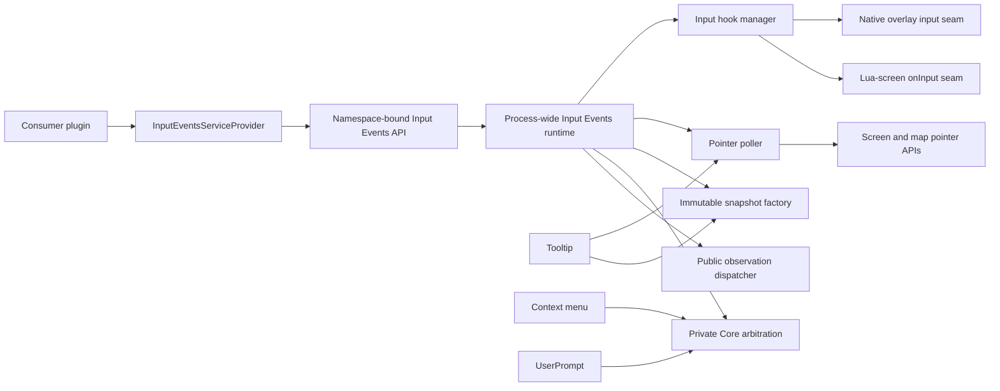

# DwarfUICore Input Events Service Proposal

## Status

Proposed on 2026-08-05. This document defines the intended version 1 public
contract and private runtime responsibilities for review. It does not authorize
implementation until the contract is approved.

The proposed service extracts existing DwarfUICore input interception and
pointer sampling into one process-wide owner. It does not replace the tooltip,
context-menu, or UserPrompt services, and it does not move their behavioral
policy into a generic event bus.

## Summary

DwarfUICore should provide an `InputEventsServiceProvider` that exposes
namespace-bound map-click observation and supports shared private input
infrastructure for Core services.

The process-wide Input Events runtime should own:

- native-overlay and Lua-screen input interception;
- continuous pointer and optional map-position sampling;
- immutable, sequenced input snapshots;
- deterministic pre-delegation arbitration for Core input consumers;
- non-consuming public event observation;
- demand-driven activation and teardown; and
- error containment, diagnostics, and reload adoption.

Tooltip, context menu, UserPrompt, and future systems should consume this shared
runtime while retaining their own target detection, state transitions,
presentation, and service-specific registrations.

Contract major 1 should publicly expose only map-click observation. Broader
event kinds or public input consumption require their own reviewed contracts.

## Motivation

DwarfUICore already has reusable input mechanisms, but their ownership is split
across consumer-specific modules:

- `dwarfuicore/context_menu/input_hook.lua` owns the authoritative native and
  Lua-screen pre-delegation input wrappers;
- `dwarfuicore/context_menu/input_sample.lua` samples screen and map coordinates
  for intercepted input;
- `dwarfuicore/pointer_poller.lua` provides demand-driven screen and map pointer
  samples;
- `dwarfuicore/tooltip/registration.lua` owns tooltip polling orchestration;
- context menu performs its own input classification and sampling; and
- UserPrompt composes through the context-menu-owned input seam despite not
  being a context-menu feature.

This structure works, but generic infrastructure is named and initialized as
though it belongs to individual consumers. Adding a public map-click event
directly to ContextMenu would deepen that ownership mismatch and encourage
future services to depend on context-menu internals.

The code already demonstrates the correct lower-level concepts: one process
hook chain, immutable samples, demand-aware map sampling, generation-aware
reload behavior, and consumer-specific target mediation. The new service should
make those boundaries explicit without centralizing unrelated UI policy.

## Goals

- Expose a typed `InputEventsServiceProvider` through
  `reqscript('dwarfuicore/services')`.
- Support one version 1 public operation, `on_map_clicked(callback)`.
- Deliver one immutable event for each eligible left-button release with an
  exact map position.
- Keep public map-click observation non-consuming.
- Preserve base-game input behavior when observers are present.
- Own exactly one process-wide native/Lua input interception chain.
- Own exactly one process-wide pointer poller.
- Sample screen and map coordinates at most once for each dispatched snapshot.
- Allow tooltip, context menu, and UserPrompt to share input mechanics while
  retaining their existing semantics.
- Provide deterministic private Core-consumer arbitration before inherited
  input handling.
- Activate hooks and polling only while a public observer or private Core
  consumer has demand.
- Follow existing namespace, identity, immutability, generation, error, reload,
  and package conventions.

## Non-goals

- A general application event bus.
- String-dispatched event names or a public generic `subscribe(event_name)` API.
- Public keyboard, raw mouse, hover, drag, double-click, or scroll events.
- Public input interception or consumer-defined input priorities.
- A global replacement for DFHack `onInput` methods.
- Shared tooltip/context-menu target registries or contribution selection.
- Shared presentation, rendering, menu opening, or prompt state machines.
- Determining that a map tile semantically owns a click over every possible
  native or third-party UI surface.
- Replacing `PointerDispatcher`, tooltip target adapters, context-menu target
  adapters, or map projection policy.
- Migrating external DwarfUI consumers as part of the initial implementation.

## Terminology

An **input snapshot** is an immutable, sequenced copy of facts sampled while one
DFHack input table is being dispatched.

A **pointer sample** is an immutable, sequenced screen-pointer snapshot produced
by the shared poller. It may include a map position when current demand requires
one.

A **Core input consumer** is a private DwarfUICore collaborator that may claim
an intercepted input boundary before the inherited handler runs.

A **public observer** is a namespace-bound callback that receives a derived
event but cannot consume or alter input dispatch.

A **map click** is an eligible left-button release whose synchronous map sample
is non-nil. It means that DFHack reported a map coordinate at that pointer
position; it does not assert universal UI ownership of the tile beneath every
possible overlay.

## Public API

### Provider acquisition

The service follows the existing exact-version, namespace-bound provider
pattern:

```lua
local services = reqscript('dwarfuicore/services')

local inputEvents =
    services.InputEventsServiceProvider:new(1, 'my-plugin')
```

Every `new()` call returns a distinct immutable API object. API objects bound to
the same namespace share one namespace domain, and all namespaces delegate to
one process-wide Input Events runtime.

### Map-click observation

```lua
local subscription = inputEvents:on_map_clicked(function(event)
    local position = event.map_position
    -- position is an immutable copied {x, y, z} value
end)
```

The proposed version 1 types are:

```lua
---@class dwarfuicore.MapClickedEvent
---@field sequence integer
---@field map_position dwarfuicore.MapTilePosition
---@field screen_position dwarfuicore.ScreenPosition|nil

---@alias dwarfuicore.MapClickedObserver fun(event: dwarfuicore.MapClickedEvent)

---@class dwarfuicore.InputEventSubscription

---@class dwarfuicore.InputEventsServiceApi
---@field get_contract_version fun(self: dwarfuicore.InputEventsServiceApi): integer
---@field get_namespace fun(self: dwarfuicore.InputEventsServiceApi): string
---@field on_map_clicked fun(self: dwarfuicore.InputEventsServiceApi, callback: dwarfuicore.MapClickedObserver): dwarfuicore.InputEventSubscription
---@field unsubscribe fun(self: dwarfuicore.InputEventsServiceApi, handle: dwarfuicore.InputEventSubscription): boolean removed
---@field is_subscribed fun(self: dwarfuicore.InputEventsServiceApi, handle: dwarfuicore.InputEventSubscription): boolean subscribed
---@field clear_namespace fun(self: dwarfuicore.InputEventsServiceApi): boolean changed
```

`MapTilePosition` and `ScreenPosition` are the existing validated copied public
value types. The callback and event values are retained only for the duration
of dispatch unless the consumer explicitly retains them.

### Registration contract

- `callback` must be a function.
- Validation completes before service initialization or registration mutation.
- Each successful call creates a distinct opaque subscription.
- Multiple subscriptions from one namespace are permitted.
- Registration order is retained for deterministic callback dispatch.
- Dropping the API object or subscription handle does not implicitly
  unsubscribe it.
- Public observers cannot consume input and their return values are ignored.
- A callback added during dispatch is not eligible for the current event.
- A callback removed before its turn during dispatch is skipped.

### Subscription operations

`unsubscribe(handle)` removes an active subscription only when the handle
belongs to the calling namespace, service kind, contract major, and runtime
generation. It returns `true` when removal occurs and `false` when a recognized
same-domain handle is already inactive.

`is_subscribed(handle)` reports whether that exact recognized same-domain
subscription remains active.

`clear_namespace()` removes every Input Events subscription owned by the bound
namespace. It never removes private Core consumers or another namespace's
subscriptions.

Malformed, stale-generation, and foreign-domain handles follow the established
`INVALID_ARGUMENT`, `STALE_HANDLE`, and `FOREIGN_HANDLE` precedence.

## Map-click event contract

Contract major 1 recognizes `_MOUSE_L` as the left-button release boundary. A
map-click event is eligible when all of the following are true:

1. Input interception is active on a supported current surface.
2. The input table contains `_MOUSE_L`.
3. No earlier private Core consumer claims that boundary.
4. `dfhack.gui.getMousePos()` returns a value with `x`, `y`, and `z`.

`_MOUSE_L_DOWN` does not publish an event. The service does not require a prior
down boundary, maintain a gesture latch, infer double-clicks, or combine
multiple input tables into one gesture.

For an eligible release, the runtime:

1. Samples the screen pointer at most once.
2. Samples the map pointer exactly once.
3. Copies and validates both available positions.
4. Creates one immutable `MapClickedEvent` with the current dispatch sequence.
5. Delegates unchanged to the inherited input handler.
6. Notifies the stable snapshot of eligible public observers in registration
   order.
7. Returns the inherited handler's original result unchanged.

Post-delegation observation prevents a callback from changing UI state before
the input reaches the inherited owner. The event retains the pre-delegation
coordinate snapshot even if inherited handling changes the current screen, map
view, or pointer interpretation.

The callback still runs when the inherited handler reports that it handled the
input. That return value does not provide a reliable cross-surface definition
of whether a map tile or an overlaid control semantically owned the click.

If the map sample is nil or malformed, no public event is published. A missing
screen sample does not suppress an otherwise valid map click; in that case
`screen_position` is nil.

## Runtime architecture

The public provider is a lightweight facade over one process-wide runtime. The
same runtime also offers private typed collaboration boundaries to DwarfUICore
services.



The runtime is infrastructure, not a semantic mediator. Each service receives
snapshots and decides what those facts mean within its own contract.

## Input interception ownership

The current context-menu input hook manager should be relocated beneath the
Input Events runtime without changing its established chain behavior during the
initial extraction.

The shared manager must continue to:

- support native-overlay and Lua-screen input owners;
- preserve compatible predecessor and foreign-wrapper chains;
- avoid duplicate active trampolines;
- repair replaced modules or methods according to current ownership rules;
- remain inert when no current dispatcher is installed;
- prevent a retired generation from dispatching into new service state; and
- restore only wrappers it still owns during destructive shutdown.

`dwarfuicore/context_menu/input_hook.lua` may temporarily re-export the relocated
manager for migration compatibility. No public consumer may depend on that
compatibility module, and it should be removed after all Core consumers use the
new owner.

## Immutable snapshots and sampling

`context_menu/input_sample.lua` and `pointer_poller.lua` currently represent two
related sample paths. The Input Events runtime should establish one canonical
snapshot factory while preserving two acquisition triggers:

- intercepted input produces an input snapshot synchronously; and
- active polling demand produces a pointer sample on a later frame.

Both snapshot forms should use the same copied position values, coordinate-space
labels, sequence allocator, immutability behavior, and map-demand rules.

Map sampling must remain demand-driven. Pointer-only tooltip registrations must
not cause `dfhack.gui.getMousePos()` to run every frame. Exact map tooltip
registrations or another private map-pointer subscriber create map demand, and
public map-click observers create map demand only for eligible intercepted left
releases.

Continuous pointer samples and intercepted input snapshots share a process-wide
sequence allocator. Sequence values establish publication order but do not
represent elapsed time or guarantee that every integer is visible to every
consumer.

## Private Core arbitration

Private Core consumers run before inherited input handling. They are registered
through typed internal collaborators, not through the public namespace-bound
API.

Each consumer returns one member of a private immutable numeric result enum:

```lua
---@enum dwarfuicore.InputDispatchResult
local InputDispatchResult = {
    PASS = 1,
    CONSUME = 2,
}
```

The real enum must be created through the existing immutable-enum helper.

Arbitration rules are:

- order is fixed by Core runtime assembly, not consumer registration timing;
- UserPrompt retains precedence over context-menu opening input;
- the first `CONSUME` result stops private arbitration and inherited delegation;
- public map-click observation is suppressed for a Core-consumed left release;
- `PASS` delegates the original keys table without mutation;
- a consumer cannot subscribe itself twice; and
- public namespaces cannot register private consumers or select priorities.

A private consumer failure on an input boundary it had already classified as
owned must fail closed when required by that consumer's contract. Fail-closed
ownership remains consumer-specific; the dispatcher must not infer ownership
from an exception alone.

## Public observer dispatch

Public observer callbacks are dispatched from a stable registration snapshot in
ascending registration sequence.

Each callback receives the same immutable event object. One observer cannot
modify the event seen by another observer. Observer return values are ignored.

An observer failure:

- is contained and recorded against that subscription and namespace;
- does not propagate through the input trampoline;
- does not prevent later observers from running;
- does not alter the inherited handler result;
- does not unregister the observer automatically; and
- does not disable tooltip, context menu, UserPrompt, or the hook chain.

Recursive input dispatch or observer-driven registration mutation must not
corrupt the active snapshot. A recursively published event receives a later
sequence and its own stable observer snapshot.

## Tooltip integration

Tooltip should use shared continuous pointer samples. It should retain:

- namespace-bound widget and map-tile registrations;
- widget-root and map-target detection;
- pointer enter, update, and leave mediation;
- immutable tooltip presentation intent; and
- completed-render presentation ownership.

The current polling-demand predicates in `tooltip/registration.lua` should
become private subscriptions or demand contributions to Input Events. Tooltip
must not receive map-click callbacks or become dependent on public observer
registration.

Tooltip registration count continues to determine tooltip sampling demand. A
tooltip with only widget targets requests screen-pointer samples; exact map
targets additionally request map-position samples.

## Context-menu integration

Context menu should use shared intercepted-input snapshots and private
arbitration. It should retain:

- context-menu widget and map contribution registries;
- root-aware and map-aware target detection;
- opening eligibility and menu assembly;
- selection callbacks;
- menu screen ownership; and
- menu-specific consumption rules.

The migration removes context menu's ownership of the generic hook and sampler;
it does not turn context-menu target detection into global map-click policy.

## UserPrompt integration

UserPrompt should remain the highest-precedence private Core input consumer while
a prompt is active. It retains its completion, cancellation, consumption,
indicator, presentation, and callback contracts.

Prompt-consumed left release must not publish a public map-click event. The
click belongs to the active authoritative prompt interaction, and leaking it to
independent observers would violate prompt exclusivity.

When no prompt is active, UserPrompt contributes no input demand and has no
effect on public map-click observation or context-menu behavior.

## Demand and lifecycle

The runtime maintains separate demand counts for:

- intercepted input;
- screen-pointer polling; and
- map-pointer polling.

The input hook is active when at least one private intercepted-input consumer or
public map-click subscription exists. The pointer poller is active only when at
least one private continuous-pointer consumer exists. Map polling occurs only
when a current continuous consumer explicitly requires map coordinates.

Removing the final demand source makes the corresponding runtime path inert.
Reload-safe trampolines may remain installed for adoption by the next runtime
generation, following existing DwarfUICore behavior.

World unload, root loss, and surface replacement invalidate current sampled
facts but do not remove public subscriptions. Subscriptions remain process-owned
until explicit removal, namespace cleanup, destructive shutdown, or runtime
generation retirement.

## Ownership and lifetime

- One Input Events runtime exists process-wide.
- Every public subscription belongs to one service kind, contract major,
  namespace, runtime generation, and local identity.
- Callback functions remain strongly retained while their subscriptions are
  active.
- Subscription handles do not expose callback functions or internal dispatch
  records.
- Private Core consumers are runtime collaborators and are not represented by
  public subscription handles.
- Explicit DwarfUICore reload invalidates APIs and handles from the retired
  generation.
- Diagnostics may report counts, identities, demand, sequences, surfaces, and
  failure text, but may not expose another namespace's callback function.

## Error contract

Provider construction and API calls use the existing exception-based error
transport and stable token format.

The provider prefix is:

```text
DwarfUICore InputEventsServiceProvider:
```

The namespace-bound API prefix is:

```text
DwarfUICore InputEventsServiceApi:
```

Argument validation, stale API/handle, foreign handle, unhealthy service, and
acquisition failures use the established stable categories and precedence.

Observer failures are asynchronous dispatch failures, not public API-call
failures. They are contained and recorded privately.

## Reload and failure behavior

- Provider construction is lazy, transactional, and non-destructive.
- Repeated construction reuses one healthy process runtime.
- Construction does not reload Core or replace a healthy active hook chain.
- Partial initialization publishes no healthy facade or subscription.
- Retired dispatchers become inert before new-generation state is published.
- Existing compatible hook trampolines may be adopted by the next generation.
- A public observer failure cannot disable private Core consumers.
- A tooltip, context-menu, or UserPrompt failure cannot remove unrelated public
  subscriptions.
- Destructive shutdown restores only input wrappers still owned by DwarfUICore.

## Compatibility and extensibility

Contract major 1 exposes only `on_map_clicked(callback)`. Compatible additions
may include private diagnostics, internal event kinds, and explicitly named
public observation methods whose semantics do not weaken existing guarantees.

The following changes require a new contract major:

- making map-click observation consuming;
- changing the recognized boundary from `_MOUSE_L` release;
- requiring a preceding down boundary;
- publishing prompt-consumed clicks;
- changing post-delegation callback ordering;
- making inherited handler results depend on observer behavior;
- changing event position copy or immutability guarantees; or
- replacing explicit methods with string-dispatched generic subscription.

Public interception, priorities, cancellation, or event transformation should
be proposed separately even if the private runtime can technically support
them.

## Migration strategy

Implementation should proceed through narrow, behavior-preserving extractions:

1. Relocate the existing context-menu input hook manager under Input Events and
   retain a temporary internal compatibility export.
2. Introduce the process-wide runtime and canonical immutable snapshot factory.
3. Migrate context menu to private arbitration without changing menu behavior.
4. Migrate UserPrompt to the same arbitration boundary without changing prompt
   behavior or precedence.
5. Move pointer-poller ownership and demand accounting into Input Events, then
   migrate tooltip polling without changing target semantics.
6. Add the namespace-bound provider, adapter, public subscription registry, and
   map-click observation contract.
7. Remove internal compatibility exports after every Core consumer uses the new
   owner.

Each extraction must preserve current behavior before the next responsibility
is moved. Public map-click observation should not become the mechanism by which
Core services communicate internally.

## Alternatives rejected

### Add `on_map_clicked` to ContextMenu

Map clicks are not context-menu semantics. This would expose generic input
through a service whose registrations, target selection, and presentation are
specific to menus, while leaving UserPrompt and tooltip dependent on
misclassified infrastructure.

### Make every service install its own hook

Parallel wrappers make precedence depend on installation and reload history.
They duplicate chain repair, root selection, sampling, diagnostics, and teardown
while making consumed-input behavior difficult to reason about.

### Put all target detection in Input Events

Tooltip, context menu, and prompts use different registrations, precedence, and
state transitions. A universal target detector would centralize policy that is
not actually shared and would make unrelated service changes risky.

### Expose a generic public event bus

A string-based `subscribe(name, callback)` surface weakens type checking,
versioning, documentation, and compatibility. Version 1 has one reviewed public
event and should expose one explicitly named method.

### Let public observers consume input

Consumption requires global arbitration, priority, failure, and conflict rules.
Allowing arbitrary namespaces to suppress base-game input would be a materially
larger and riskier contract than map-click notification.

### Derive map ownership from inherited return values

An inherited `onInput` result does not consistently distinguish map ownership
from overlays, controls, or viewscreens. Version 1 therefore reports the
narrower fact that a left release had an exact map coordinate.

### Publish before inherited input handling

A public callback could open or dismiss UI, move the map, or mutate game state
before the original click reaches its existing owner. Post-delegation
observation preserves inherited behavior and reports the pre-delegation sample.

## Acceptance criteria

The proposal is satisfied when implementation and evidence demonstrate all of
the following:

- `InputEventsServiceProvider` follows the existing immutable namespace-bound
  acquisition pattern and shares one healthy process runtime;
- public registration, unsubscription, status, and namespace cleanup enforce
  service, contract, namespace, generation, and identity boundaries;
- each eligible unconsumed `_MOUSE_L` release samples map position exactly once
  and publishes at most one immutable map-click event;
- `_MOUSE_L_DOWN`, off-map releases, and Core-consumed prompt releases do not
  publish map-click events;
- public observers cannot consume input or alter the inherited handler result;
- observer callbacks run after inherited handling against the pre-delegation
  coordinate snapshot;
- callback ordering and mutation during dispatch are deterministic;
- one observer failure is contained without suppressing later observers or
  disabling another service;
- the native and Lua input seams retain current wrapper-chain, repair, reload,
  and cleanup behavior;
- tooltip uses shared demand-driven pointer sampling while retaining tooltip
  target and presentation semantics;
- context menu uses shared intercepted-input snapshots while retaining menu
  target, opening, and consumption semantics;
- UserPrompt retains prompt-first arbitration and does not leak owned clicks to
  public observers;
- no duplicate process hook or pointer-poller chain remains after migration;
- map-coordinate polling does not occur without current map demand; and
- focused unit evidence, existing-service regressions, live native/Lua input
  evidence, installed-runtime evidence, reload evidence, and cleanup evidence
  are recorded as distinct results.

## Recommendation

Approve `InputEventsServiceProvider` contract major 1 with public
`on_map_clicked(callback)` observation and the private shared-input ownership
defined above. After approval, create an implementation checklist governed by
this proposal and perform the extraction in behavior-preserving increments.
