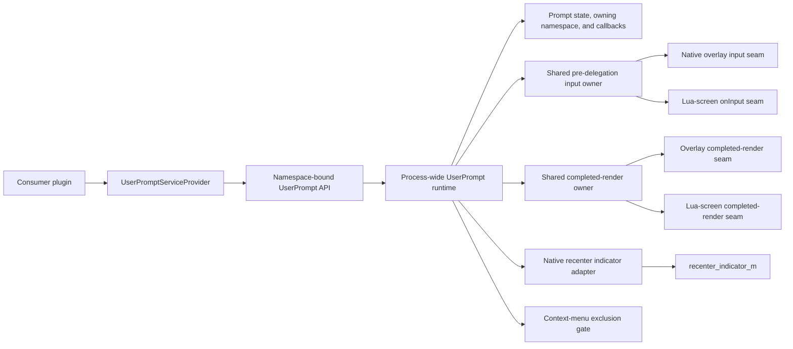
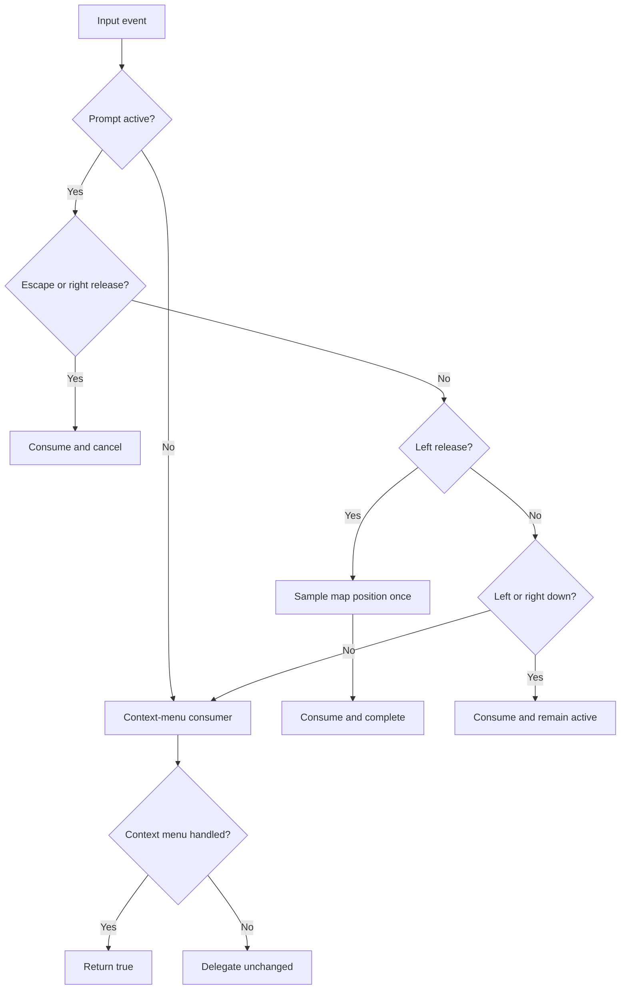
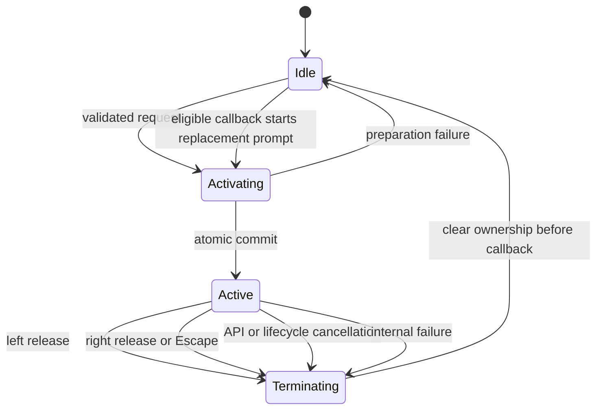
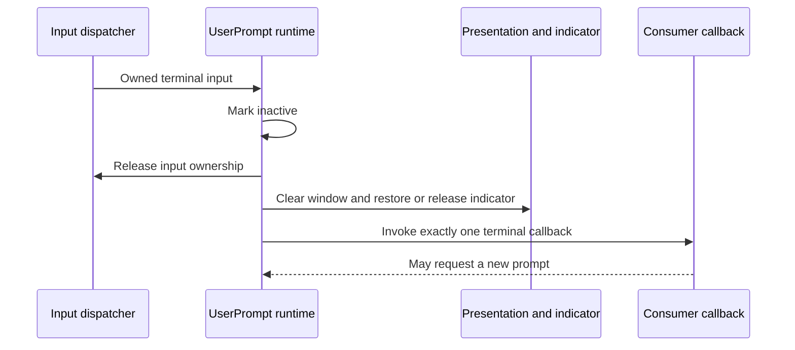

# DwarfUICore UserPrompt Service Proposal

## Status

Proposed on 2026-08-02. This document defines the intended version 1 public
contract and runtime behavior for review. It does not authorize implementation
until the contract is approved.

The existing DwarfUICore namespaced service-provider framework is complete.
`UserPromptServiceProvider` extends that framework; it does not replace or
redesign it. After approval, the implementation checklist must be reconciled
with this proposal before production work begins.

## Summary

DwarfUICore should provide a reusable `UserPrompt` service for asynchronous,
user-driven interactions. The first supported interaction asks the user to
select a location on the fortress map.

While a map-location prompt is active:

- a tooltip-like window follows below the mouse and displays consumer-provided
  title and message text;
- the owning consumer namespace is centered in the window's top border;
- the game's native map-tile selection indicator follows the map tile beneath
  the mouse;
- left mouse input is consumed so it cannot reach the base game;
- releasing the left mouse button completes the prompt with the current map
  sample, including `nil` when the pointer is not over a map tile;
- right-click or Escape consumes the input and cancels the prompt; and
- DwarfUICore context menus cannot remain open or open anew.

The service is asynchronous and callback-based. It owns at most one active
prompt process-wide and exposes an opaque handle for cancellation and status
queries.

## Motivation

Consumer plugins repeatedly need temporary interactions that suspend their
normal workflow while the user makes a choice in the game UI. Implementing
these interactions independently is error-prone because input must be captured
before the base game, presentation must use the correct completed-render seam,
and teardown must survive screen changes and reloads.

DwarfDirect demonstrates the essential input rule: an input-owning layer must
run before competing dwarfmode handlers and return `true` for consumed events.
Its fullscreen targeting overlay, action-specific validation, and custom
targeting state are not appropriate shared infrastructure for DwarfUICore.

DwarfUICore already owns the reusable mechanisms needed to solve the problem:

- typed, namespace-bound service providers;
- process-wide service runtimes and reload generations;
- root-aware pre-delegation input hooks;
- pointer and map-position sampling;
- completed-render presentation hooks; and
- context-menu and tooltip lifecycles.

The new service should compose those mechanisms under one explicit prompt
lifecycle instead of installing a competing screen or hook chain.

## Goals

- Expose a typed `UserPromptServiceProvider` through
  `reqscript('dwarfuicore/services')`.
- Support one version 1 operation, `prompt_map_location(options)`.
- Guarantee exact input-consumption behavior for left-click, right-click, and
  Escape while the prompt is active.
- Report the left-release map sample without validating or filtering it.
- Present title and message text in an input-transparent window below the
  pointer.
- Attribute the window to its owning namespace in the top-center border without
  accepting a consumer-supplied display override.
- Use the game's native recenter indicator for map-tile feedback without
  recentering or otherwise manipulating the map view.
- Make UserPrompt and context-menu sessions mutually exclusive.
- Preserve the current tooltip and context-menu behavior whenever no prompt is
  active.
- Follow existing namespace, immutability, generation, error, reload, and
  package conventions.

## Non-goals

- Generic string-dispatched prompt kinds or a public prompt-kind enum.
- Unit, item, building, area, list, confirmation, text, quantity, or
  multi-location prompts.
- Prompt queues, priorities, replacement, timeouts, persistence, promises,
  coroutine suspension, or blocking calls.
- Consumer-defined map-position validation or rejection messages.
- A fullscreen `gui.ZScreen` or DwarfDirect-style targeting overlay.
- A normal tooltip registration or public access to tooltip internals.
- A custom map marker, `renderMapOverlay()`, or a call to
  `dfhack.gui.revealInDwarfmodeMap()`.
- Migration of DwarfUI, DwarfDirect, or another consumer plugin as part of the
  service implementation.

## Public API

### Provider acquisition

The service follows the existing exact-version, namespace-bound provider
pattern:

```lua
local services = reqscript('dwarfuicore/services')

local userPromptService =
    services.UserPromptServiceProvider:new(1, 'my-plugin')
```

Every `new()` call returns a distinct immutable API object. API objects for the
same namespace share one namespace domain, and every namespace delegates to one
process-wide UserPrompt runtime. The bound namespace is also the authoritative
owner label rendered on every prompt opened through that API.

### Map-location prompt

```lua
local prompt = userPromptService:prompt_map_location({
    title='Choose destination',
    message='Left-click a map tile. Right-click or press Esc to cancel.',
    on_select=function(pos)
        if pos then
            -- pos is a detached {x, y, z} value
        else
            -- the accepted left-click had no map position
        end
    end,
    on_cancel=function()
        -- optional cancellation notification
    end,
})
```

The proposed version 1 types are:

```lua
---@class dwarfuicore.MapLocationPromptOptions
---@field title string
---@field message string
---@field on_select fun(position: dwarfuicore.MapTilePosition|nil)
---@field on_cancel? fun()

---@class dwarfuicore.MapLocationPrompt

---@class dwarfuicore.UserPromptServiceApi
---@field get_contract_version fun(self: dwarfuicore.UserPromptServiceApi): integer
---@field get_namespace fun(self: dwarfuicore.UserPromptServiceApi): string
---@field prompt_map_location fun(self: dwarfuicore.UserPromptServiceApi, options: dwarfuicore.MapLocationPromptOptions): dwarfuicore.MapLocationPrompt
---@field cancel fun(self: dwarfuicore.UserPromptServiceApi, handle: dwarfuicore.MapLocationPrompt): boolean cancelled
---@field is_active fun(self: dwarfuicore.UserPromptServiceApi, handle: dwarfuicore.MapLocationPrompt): boolean active
---@field clear_namespace fun(self: dwarfuicore.UserPromptServiceApi): boolean changed
```

`MapTilePosition` is the existing copied `{x, y, z}` public value type.

### Option contract

- `options` must be a table containing only the documented fields.
- `title` and `message` are required strings. Their contents are copied exactly;
  empty strings and embedded newlines are valid.
- `on_select` is required and must be a function.
- `on_cancel` is optional and, when present, must be a function.
- The options record is validated completely before service initialization or
  prompt-state mutation and is copied before storage.
- Consumer mutation of the original table after acceptance has no effect on
  the active prompt.
- Namespace attribution is not an option field. The facade copies the API's
  validated bound namespace into the private request snapshot, so a consumer
  cannot omit, rename, or spoof the displayed owner.

Title and message presentation limits, wrapping, colors, and frame styling are
private rendering policy within contract major 1 so long as both copied strings
are rendered in distinct regions when non-empty. The presence and ownership
source of the namespace border label are public version 1 behavior, while its
pen and decorative frame style remain private rendering policy.

### Handle operations

`cancel(handle)` cancels the active prompt only when the handle belongs to the
calling namespace, service, contract major, and runtime generation. It returns
`true` when it performs cancellation and `false` when a recognized same-domain
handle is no longer active.

`is_active(handle)` returns whether that exact recognized same-domain prompt is
the currently active prompt. A completed or cancelled handle returns `false`.

`clear_namespace()` cancels the active prompt when it belongs to the bound
namespace and otherwise returns `false`. It never affects another namespace.

Malformed, stale-generation, and foreign-domain handles follow the established
`INVALID_ARGUMENT`, `STALE_HANDLE`, and `FOREIGN_HANDLE` precedence.

### Busy behavior

Only one prompt may be active process-wide. A second
`prompt_map_location()` request fails before changing any service, menu,
presentation, or indicator state.

Version 1 adds the stable `SERVICE_BUSY` error token because an otherwise valid
request encountering an occupied process-wide interaction is neither an
invalid argument nor provider initialization reentry. The error uses the normal
exception transport and `DwarfUICore UserPromptServiceApi:` prefix.

## Runtime architecture

The public provider remains lightweight. The private adapter acquires one
process-wide runtime, which coordinates existing input and render ownership
with prompt-specific state and the native indicator.



The input and render boxes describe ownership roles, not a mandate for broad
new frameworks. Before generalizing a shared type, implementation must prove
that the current single-handler or single-presenter seam cannot safely support
the required composition. Any change should be the smallest internal extension
that retains a single authoritative hook chain.

## Activation contract

Starting a prompt is transactional:

1. Validate the API receiver, runtime generation, options, and callback types.
2. Reject the request if another prompt is active.
3. Resolve the current supported map-capable input and presentation surface.
   Absence of such a surface fails with `INVALID_ARGUMENT`.
4. Prepare every fallible input and render dependency and take a detached
   snapshot of the native indicator without exposing an active prompt.
5. Close any open DwarfUICore context menu.
6. Publish active prompt state, activate the already-prepared prompt-first
   input arbitration, take indicator ownership, and publish render intent using
   only non-failing assignments as one commit.
7. Invalidate the selected owner so presentation appears immediately.

If preparation fails, the call raises an established service error and leaves
no pending prompt, prompt input consumer, render intent, context-menu mutation,
or indicator ownership. No failing operation may remain after the context menu
is closed and before the active state is committed.

Calling `prompt_map_location()` without a currently supported map-capable
surface fails before activation. This admission rule does not weaken the input
contract after a prompt has been accepted.

## Input contract

The prompt consumer runs before context-menu input and before the inherited
base-game handler. It owns only the following active-prompt boundaries:

| DFHack key | Consumed | Result |
| --- | --- | --- |
| `_MOUSE_L_DOWN` | Always | Remain active; do not sample or invoke a callback. |
| `_MOUSE_L` | Always | Sample once, complete, and call `on_select(position_or_nil)`. |
| `_MOUSE_R_DOWN` | Always | Remain active; prevent press leakage. |
| `_MOUSE_R` | Always | Cancel and call `on_cancel()` when supplied. |
| `LEAVESCREEN` | Always | Cancel and call `on_cancel()` when supplied. |
| Any other input | No | Delegate unchanged to later consumers and the predecessor. |

The `_MOUSE_L` handler calls `dfhack.gui.getMousePos()` exactly once within that
handler. It does not require `_MOUSE_L_DOWN`, consult a gesture latch, hit-test
widgets, check map ownership or focus, validate the position, or reject `nil`.
It copies a non-nil `{x, y, z}` result before callback dispatch.

If one input table contains multiple owned boundaries, cancellation takes
precedence over completion: `LEAVESCREEN` or `_MOUSE_R`, then `_MOUSE_L`, then
nonterminal down boundaries. Exactly one terminal outcome is dispatched.

If prompt handling unexpectedly fails after the dispatcher identifies an owned
boundary, the event remains consumed. The prompt is terminated safely, the
failure is recorded privately, and the event cannot leak to a context menu or
the base game.



## Context-menu exclusion

UserPrompt and DwarfUICore context-menu sessions are mutually exclusive:

- accepting a prompt synchronously closes an existing context menu without
  invoking a menu selection callback;
- every internal context-menu opening path checks that no prompt is active;
- active prompt right-click boundaries are consumed before context-menu input;
  and
- context-menu registrations remain intact and become usable normally after
  the prompt terminates.

This is a runtime interaction invariant, not namespace precedence. A context
menu from the same namespace is no more eligible than one from another
namespace while any prompt is active.

## Prompt presentation

The prompt window is an independent presentation intent rendered through
DwarfUICore's completed-render ownership. It is not a tooltip registration and
does not participate in tooltip target selection or namespace collision rules.

Presentation behavior:

- render the validated owning namespace centered in the top border, using the
  complete value whenever it fits and the specified truncated form otherwise;
- show the exact copied title and message as visually distinct content;
- anchor the window below the current screen pointer;
- clamp the complete window within the viewport when it cannot fit at the
  preferred location;
- update after pointer motion and viewport resizing;
- when no screen-pointer coordinate is available, temporarily hide the prompt
  window and native indicator without terminating the prompt, then restore
  presentation when coordinates become available;
- remain input-transparent and never affect map sampling; and
- disappear before any terminal callback executes.

Namespace attribution uses DFHack's existing framed-window title support. The
prompt renderer passes the namespace as the title argument to
`gui.paint_frame()`, while the consumer-provided prompt title remains inside the
window body. These are separate fields with separate visual roles.

When the viewport permits, prompt layout makes the frame at least
`#namespace + 6` cells wide so DFHack's border-title padding and both frame
corners fit without clipping. The normal wrapped title/message width may make
the frame wider. The final width is still bounded by the viewport.

If the complete namespace cannot fit, the renderer truncates it before calling
`gui.paint_frame()` and then centers the truncated value. When at least four
label cells are available, truncation keeps the longest fitting prefix followed
by ASCII `...`; with fewer cells, it keeps the fitting prefix without an
ellipsis. This affects display only: the request and handle retain the complete
namespace.

While the prompt is active, it takes precedence over normal pointer-following
tooltip presentation. Tooltip registrations and selected tooltip intent remain
untouched, but the ordinary tooltip window is suppressed to avoid two windows
competing for the same pointer anchor. Normal tooltip presentation resumes
after prompt termination.

This suppression is presentation-only. It does not clear tooltip state, alter
tooltip ownership, or expose UserPrompt through the tooltip API.

## Native map-tile indicator

DwarfUI's mood-popover unit selection ultimately highlights the selected tile
by assigning the game's native
`df.global.game.main_interface.recenter_indicator_m`. UserPrompt should use the
same native indicator directly.

It must not call `dfhack.gui.revealInDwarfmodeMap()`: that helper can unfollow,
pan or recenter the map, and change the displayed z-level in addition to setting
the indicator.

Indicator behavior:

- snapshot a detached copy of the pre-prompt indicator before the first write;
- while the pointer has a map position, assign that position directly;
- while the pointer has no map position, assign the verified native inactive
  representation while leaving the prompt active;
- sample again as pointer state changes so the marker follows map hover;
- keep the visual sample separate from the authoritative click sample; and
- restore the pre-prompt snapshot on termination only while ownership remains.

Before every write after the first, the adapter compares the current native
value with its last write. A mismatch indicates another system has taken
ownership. UserPrompt then stops writing for the remainder of that prompt and
does not restore its snapshot on termination. This prevents teardown from
overwriting a newer external selection.

The target DFHack version's inactive sentinel and value-copy semantics must be
verified against the installed bindings before implementation. They remain a
private compatibility concern and are not exposed through the public API.

## State and callback lifecycle

There is one process-wide state machine. A terminal transition first makes the
old prompt inactive and clears every owned resource, then invokes at most one
callback.



Terminal ordering is fixed:

1. Mark the handle inactive and remove the authoritative pending request.
2. Deactivate prompt-first input consumption.
3. Remove prompt render intent and tooltip suppression.
4. Restore or relinquish the native indicator according to ownership.
5. Invalidate the affected presentation owner.
6. Invoke `on_select(position_or_nil)` or `on_cancel()` once.
7. Contain and record callback failure without reviving the prompt.



`on_select` and `on_cancel` are mutually exclusive. Callback failures are
reported through private diagnostics and do not propagate through the input
trampoline, invoke the other callback, or disable unrelated services.

Completion, right-click, Escape, and explicit `cancel(handle)` callbacks may
synchronously open a replacement prompt because the old prompt is already
inactive. Cleanup boundaries retain their exclusion until callback dispatch
finishes: reentry during `clear_namespace()` is rejected for that namespace,
and reentry during root loss, world unload, service failure, or Core retirement
is rejected by the corresponding unavailable runtime or surface state.

## Lifecycle cancellation

Every accepted prompt ends through completion or cancellation; no lifecycle
boundary silently abandons it.

| Cause | Outcome | Public callback |
| --- | --- | --- |
| Left release | Completion | `on_select(position_or_nil)` |
| Right release | Cancellation | `on_cancel()` when supplied |
| Escape | Cancellation | `on_cancel()` when supplied |
| `cancel(handle)` | Cancellation | `on_cancel()` when supplied |
| Owning `clear_namespace()` | Cancellation | `on_cancel()` when supplied |
| Input or presentation root loss | Cancellation | `on_cancel()` when supplied |
| World/map unload | Cancellation | `on_cancel()` when supplied |
| Internal prompt failure | Cancellation | `on_cancel()` when supplied; failure is contained |
| Explicit DwarfUICore reload | Cancellation | `on_cancel()` when supplied; reentry is rejected |

During Core retirement, the runtime is marked unavailable before callback
dispatch. A callback may attempt reentry, but acquisition or prompt creation
fails through the established unhealthy/retiring runtime contract instead of
creating state in a retiring generation.

## Ownership and lifetime

- One active prompt exists process-wide, regardless of namespace.
- The active request retains its copied strings and callback functions until
  termination.
- Dropping an API object or prompt handle does not implicitly cancel the prompt.
- A handle operates only within its service kind, contract major, namespace,
  and runtime generation.
- `clear_namespace()` can cancel only a prompt owned by its bound namespace.
- Explicit DwarfUICore reload invalidates all APIs and handles from the retired
  generation.
- Private diagnostics may expose identities, counts, state, terminal cause,
  selected transports, and failure text, but never expose another namespace's
  callback functions.

## Error contract

Provider construction and API calls use the existing exception-based error
transport and stable token format.

The provider prefix is:

```text
DwarfUICore UserPromptServiceProvider:
```

The namespace-bound API prefix is:

```text
DwarfUICore UserPromptServiceApi:
```

Existing categories retain their meanings. Version 1 adds `SERVICE_BUSY` for a
valid request rejected because another process-wide prompt is active. Argument
validation, stale API/handle, foreign handle, unhealthy service, and acquisition
failures continue to use their established tokens and precedence.

Callback failures are not public API-call failures because the originating API
call has already returned. They are contained and recorded privately.

## Reload and failure behavior

- Provider construction is lazy, transactional, and non-destructive.
- Repeated construction reuses a healthy UserPrompt singleton.
- Ordinary construction never reloads Core, rescans overlays, replaces input or
  render owners, closes menus, or changes an active prompt.
- Prompt retirement occurs before shared input/render owners are retired.
- Reload-safe trampolines may remain inert for adoption by the next generation,
  following existing DwarfUICore practice.
- Partial initialization publishes no healthy service or facade and leaves no
  prompt-owned UI or indicator state.
- A failure in UserPrompt does not disable tooltip or context-menu registration
  state.

## Compatibility and extensibility

Contract major 1 exposes only map-location prompting. Future prompt operations
may be added as explicitly named methods when their behavior is defined. They
must not retroactively turn `prompt_map_location()` into a generic dispatched
operation.

Compatible changes include private renderer styling, internal diagnostics, and
optional new API methods consistent with the existing provider versioning
policy. Renaming callbacks, changing nil completion into cancellation, changing
input consumption, removing or sourcing namespace attribution from anything
other than the bound API, adding queueing, or changing handle ownership requires
a new contract major.

## Alternatives rejected

### Dedicated fullscreen screen

A DwarfDirect-style fullscreen screen can reliably consume input, but it would
create a competing UI owner and duplicate root, render, and reload behavior
already centralized in DwarfUICore.

### Normal tooltip registration

A prompt is authoritative process state, not a hover contribution. Treating it
as a tooltip registration would entangle it with target selection, namespace
collisions, and widget/map registration lifetime.

### Independent input and render hooks

Parallel hooks make ordering dependent on wrapper installation and reload
history. UserPrompt must compose through the current authoritative seams with
explicit prompt-first arbitration.

### `revealInDwarfmodeMap()` for the indicator

The helper performs more than indicator assignment and can change map view and
follow state. The prompt needs feedback only, so direct indicator assignment is
the narrower operation.

### Completing from the displayed marker

The marker is presentation state and can be stale, hidden, or externally
reowned. Completion must report a fresh synchronous sample from the exact left
release event.

## Acceptance criteria

The proposal is satisfied when implementation and evidence demonstrate all of
the following:

- the new provider follows the existing immutable namespace-bound acquisition
  pattern and shares one healthy process runtime;
- prompt admission is transactional and only one prompt can be active;
- left down always consumes without sampling, and left release always consumes
  and completes with one fresh `{x, y, z}|nil` sample;
- right down consumes without terminating, while right release and Escape
  consume and cancel exactly once;
- no prompt-owned input reaches context-menu or base-game handling, including
  prompt handler failure;
- an existing context menu closes on prompt activation and none can open while
  the prompt remains active;
- all other input and all inactive behavior delegates unchanged;
- the prompt window visibly follows below the pointer where space permits,
  clamps within the viewport, displays the bound namespace centered in its top
  border, distinguishes that attribution from the prompt title, suppresses only
  normal tooltip presentation, and remains input-transparent;
- long namespaces expand the frame when space permits and otherwise follow the
  specified deterministic truncation rule without changing stored ownership;
- the native map indicator follows hover without panning or z-level changes,
  hides off-map, respects external takeover, and restores prior owned state;
- terminal state and all owned UI/input/indicator resources clear before
  callback dispatch, allowing safe replacement-prompt reentry;
- namespace cleanup, root loss, world unload, failure, and reload leave no
  active or hidden prompt state; and
- focused unit evidence, existing-service regressions, live input evidence,
  rendered-screen evidence, installed-runtime evidence, and cleanup evidence
  are recorded as distinct results.

## Recommendation

Approve `UserPromptServiceProvider` contract major 1 with the API and behavior
defined above. After approval, revise the implementation checklist so this
proposal is its governing contract, then implement the smallest internal input
and render composition changes proven necessary by the current code.
